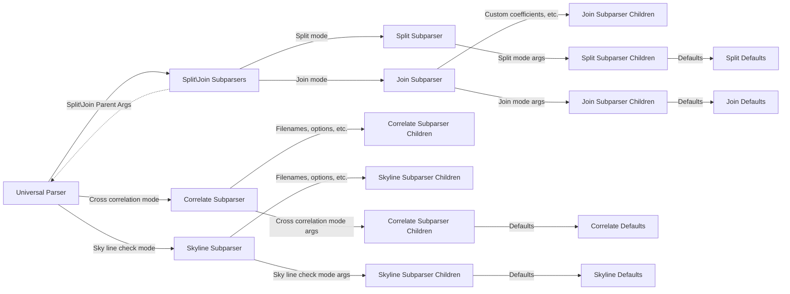
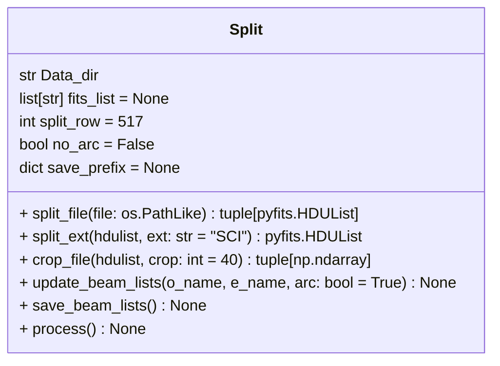
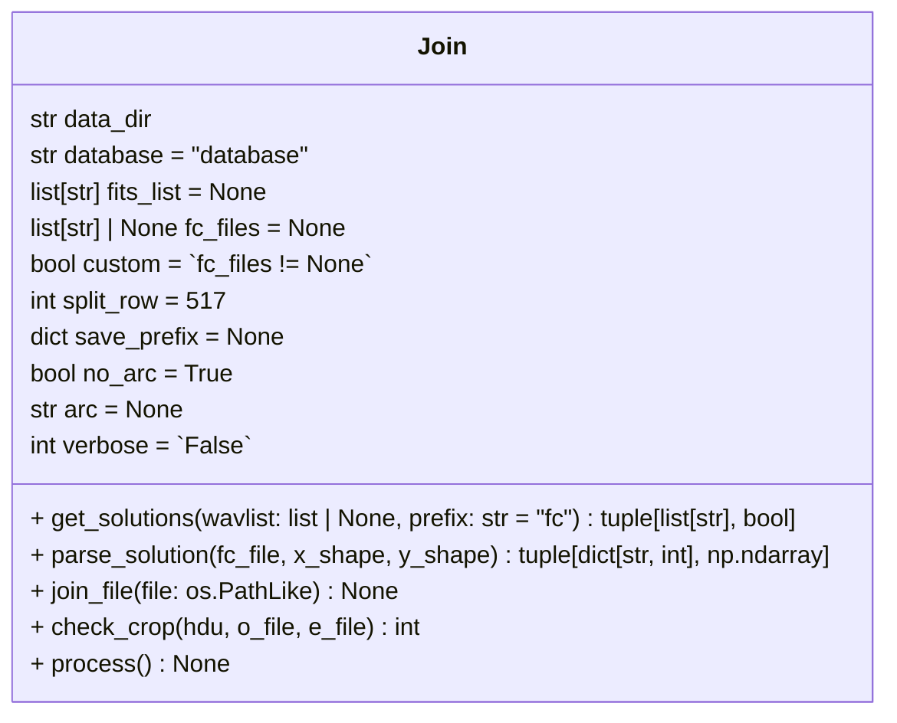

# Look at all TODO comments.
* Move all TODO comments here
* Handle direct call in main()
* Add verbosity logging statements (check log to logfile)
* Complete `NumPy styled` docstrings

## __main__.py
  * Add plot return options? [open | open and save to file | file]
  * Add type of file check (I.E. FITS)

## split.py
  * self.split_row → Check valid split row at assignment
  * self.save_prefix → Check valid dict at assignment

## join.py
  * self.split_row → Check valid split row at assignment
  * self.save_prefix → Check valid dict at assignment

## correlate.py
  *

## skylines.py
  *

# Using general python project structure
  * make sure implemented throughout
  * create dependencies.txt
  * create Makefile to clear up installation
  * update docs to reflect updated structure

  * refer to:
      * https://docs.python-guide.org/writing/structure/

# Using NumPy docstring formatting as well as type hinting
  * make sure implemented throughout
  * make sure type hinting using correct types (I.E. find type for fits files and implement)

  * refer to:
      * https://numpydoc.readthedocs.io/en/latest/format.html
      * https://docs.python.org/3/library/typing.html

# Implement logging
  * make sure implemented throughout
  * decide on log structure (I.E. [Datetime] Function called and returned {output} / raised FileNotFound error)

  * refer to:
      * https://realpython.com/python-logging/
  