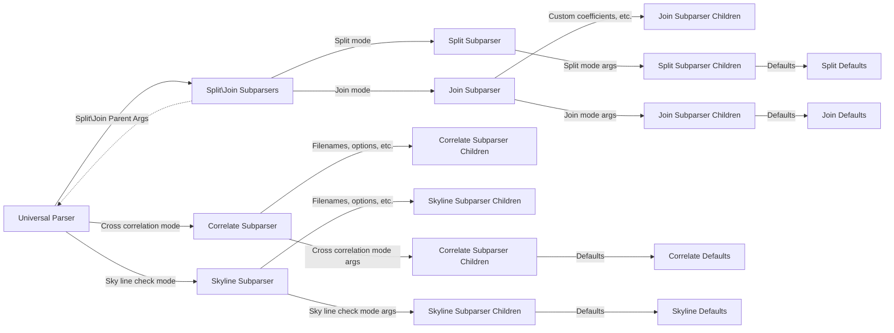
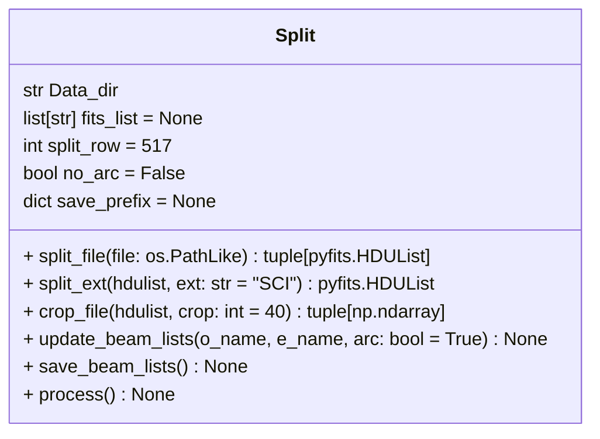
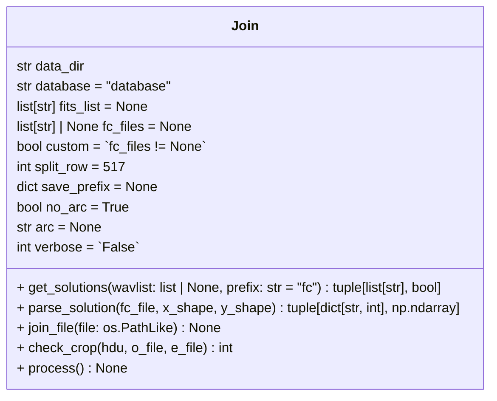

# \_\_main\_\_.py
  * Add type of file check (I.E. FITS)
  * Add plot return options? [open | open and save to file | file]

# split.py
  * self.split_row → Check valid split row at assignment
  * self.save_prefix → Check valid dict at assignment

# join.py
  * self.split_row → Check valid split row at assignment
  * self.save_prefix → Check valid dict at assignment

# correlate.py
  * Update correlate (fits_list ← in1/in2), (cont_ord ← cont)
  * LoadFile: Recheck return of o and e beams.
  * Complete correlate

# skylines.py
  * Complete skylines

# Using general python project structure
  * Handle direct calls in main()?
  * Create Makefile to clear up installation
  * Create license (CC BY-SA 4.0 international(?))
    * https://github.com/santisoler/cc-licenses
    * https://creativecommons.org/licenses/by-sa/4.0/deed.en
    * check NC, etc.

  * Refer to:
      * https://docs.python-guide.org/writing/structure/

# Using NumPy docstrings / type hinting
  * Make sure implemented throughout
  * Make sure type hinting using correct types

  * Refer to:
      * https://numpydoc.readthedocs.io/en/latest/format.html
      * https://docs.python.org/3/library/typing.html

# Implement logging
  * Make sure implemented throughout
  * Add verbosity logging statements

  * Refer to:
      * https://realpython.com/python-logging/

# Testing
  * Add tests for \_\_main\_\_
  * Add tests for each module
  * Add tests for utils

  * Refer to:
      * https://docs.python-guide.org/writing/tests/