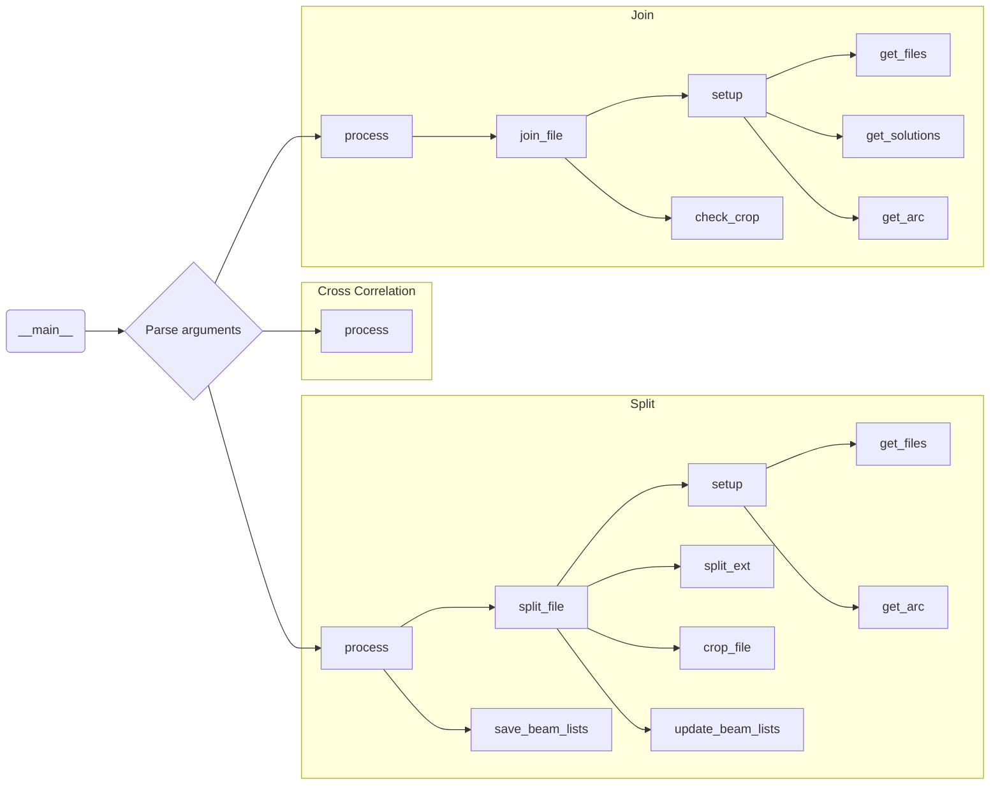

<!--- https://jojozhuang.github.io/tutorial/mermaid-cheat-sheet/ -->
<!--- https://mermaid-js.github.io/mermaid-live-editor/edit#pako:eNptkU1PwzAMhv9KlBMT6x-odkFskzjstNs0CbmJKVbzAfnQBF3_-9KyhNHhU_zYr_U67rmwEnnNhQLv1wStA300LMWTIQ2Krc5VxdZRdPd0S_79nh6wcfAH1-yRTGDQ4hzvgyPTshaNRHdbHCV-Bzo9HxazgoaAGU62J3v9D2BlaIPQPVtlXSn4E-ksTOlnBNHlfLidNy5W5lWjd0_f-GK2iKFgAWYD4V_99AW_hhprFSP_eiIlC3TRzLQ5-JJrdBpIprv0Q0rjh0w7byQF63j9BsrjkkMMdv9lBK-Di5ibrie8dg0XGq-Rag -->
<!--- Ctrl + K, V to split screen with output -->

